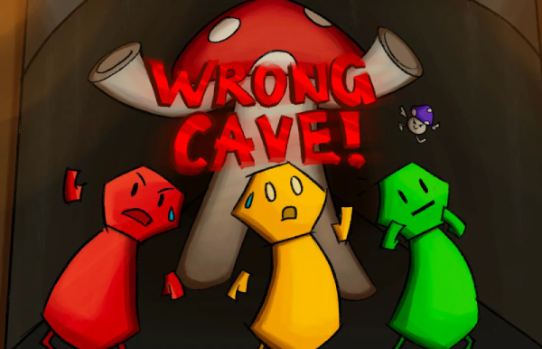
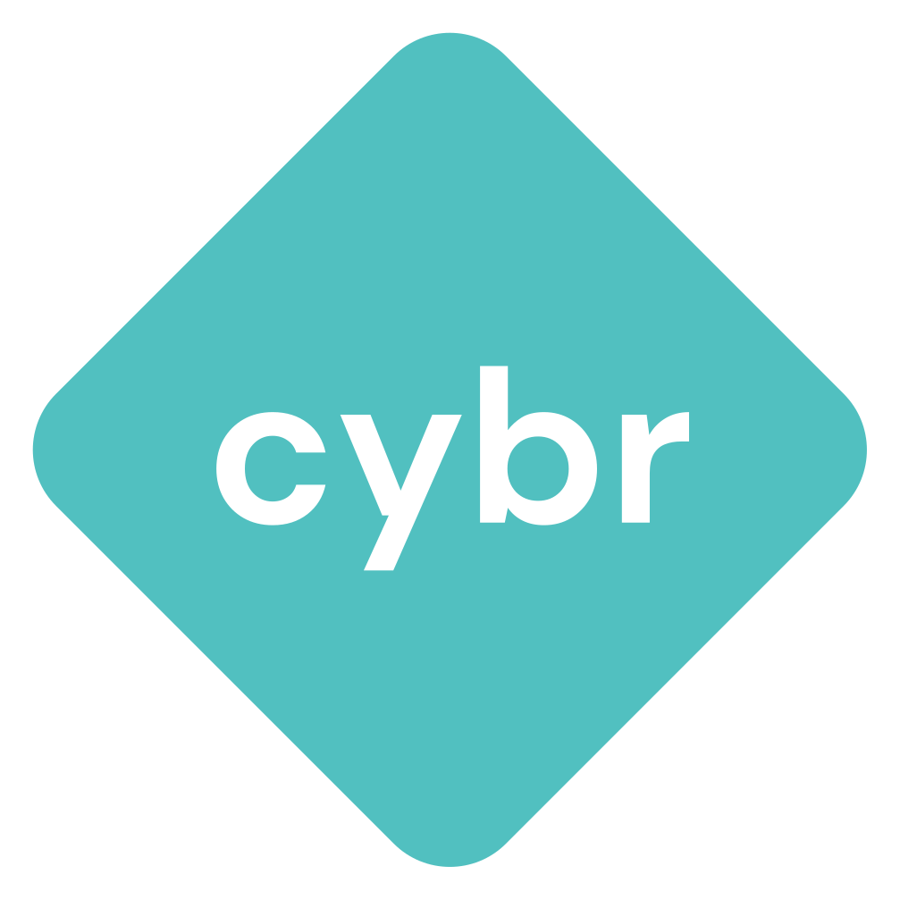
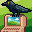
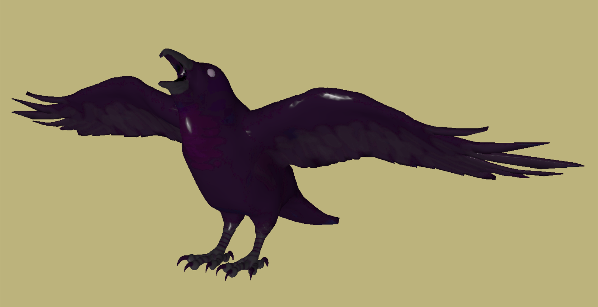

# [npetr.one](https://npetr.one)

Hi there!

I'm Nick, a Computer Science Master's student at [UC San Diego](https://ucsd.edu).

I'm interested in security, automation, software+game development, woodworking, and birds 🐦✨

You can email me if you're not a bot: <button class="bot-button">[by clicking here]</button></style>

---

## OSINT me!
Here are some things you might stumble across by googling my name and some keywords:

### [Wrong Cave!](https://cse125.ucsd.edu/2024/cse125g1/)

Wrong Cave! is a distributed real-time 3D multiplayer game
I developed with a team of 7 over the course of 10 weeks as part of 
<a href="https://cse125.ucsd.edu/2024/groups">CSE 125 (Software System Design and Implementation)</a>

### UCSD CSE Teaching Assistant Positions
I've been a TA for 4 classes so far:
- [CSE 120: Operating Systems (Fall 2025)](https://cseweb.ucsd.edu/classes/fa25/cse120-a/)
- [CSE 29: Operating Systems (Summer Session I 2025)](https://ucsd-cse29.github.io/ss1-25/)
- [CSE 120: Operating Systems (Spring 2025)](https://cseweb.ucsd.edu/classes/sp25/cse120-a/)
- [CSE 127: Intro to Computer Security (Winter 2025)](https://cseweb.ucsd.edu/classes/wi25/cse127-a/)

### [ACM Cyber at UC San Diego](https://cyber.acmucsd.com/)

I was the president of the largest cybersecurity student organization at UCSD for the 2024-2025 academic year 😎. For the two years before that,
I was a workshop host and ran technical events, managed event logistics, and engaged students through presentations and live demos. From 
the beginning of my time at UC San Diego in 2021, I developed challenges for [San Diego CTF (SDCTF)](https://sdc.tf), San Diego's largest
[Capture the Flag](https://ctftime.org/ctf-wtf/) competition. In 2023 and 2024, I managed SDCTF infrastructure, challenge deployment, and challenge platform
hosting via multiple cloud hosting providers (first GCP, then AWS EC2). I've since graduated, but I am still providing guidance and mentorship to 
the new board when I can.

### [UCSD CSE Pixel Art Competition](https://web.archive.org/web/20251124130354/https://pixel-art.goto.ucsd.edu/output.html)

 

I made some pixel art of a raven sitting on top of a computer and it won a competition. I later
updated it to fix some of the shading. I'm quite pleased with how it turned out!

### [CSE 167 (Computer Graphics)](https://cseweb.ucsd.edu/~tzli/cse167/fa2025/)

I 3d modeled and textured a raven using Blender, then rendered it using my own OpenGL rasterizer. It was featured on the course website and in-class as an example for future students taking the class.

---

This site is still a work-in-progress! I'll incrementally be adding content when I find the time. Thanks for reading :>

